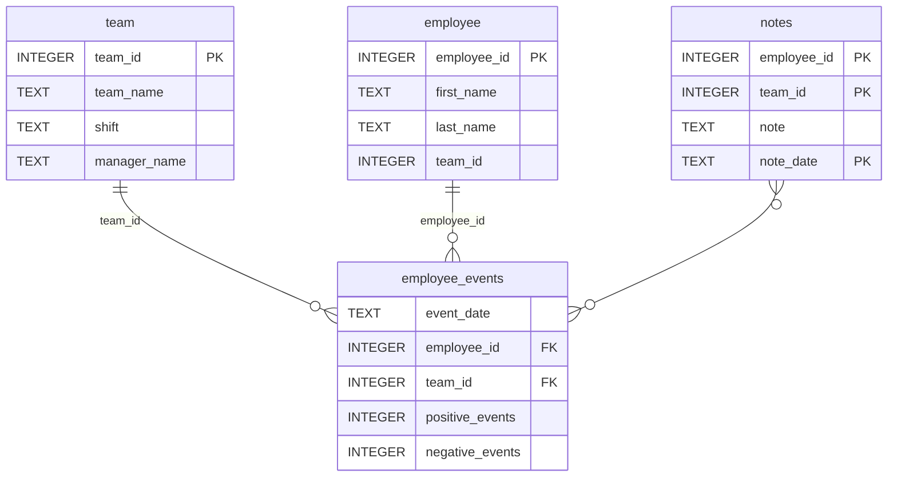

# Employee Events Dashboard

A small internal-tools dashboard built for the **Software Engineering for Data Scientists** final project. It shows employee and team performance data from a SQLite database: cumulative positive and negative events over time, a machine-learning prediction of recruitment risk, and the notes recorded for each employee or team.

The project has three layers:

- **`employee_events` Python package** (`python-package/`): queries the SQLite database. `QueryBase` holds the shared SQL, `Employee` and `Team` subclass it, and `QueryMixin` provides the SQL execution helpers.
- **Component library** (`report/base_components/`, `report/combined_components/`): reusable [FastHTML](https://fastht.ml) building blocks (dropdown, radio buttons, data table, matplotlib charts).
- **Dashboard** (`report/dashboard.py`): a FastHTML app that combines the components into a report page.

The data in the database is synthetic. It is generated by `src/build_project_assets.py`.

## Requirements

- Python 3.13 (developed and tested on 3.13.2)
- The pinned packages in `requirements.txt`

## Setup

Run these commands from the root of the repository:

```bash
python -m venv .venv
source .venv/bin/activate        # Windows: .venv\Scripts\activate
pip install -r requirements.txt
```

`requirements.txt` pins every dependency and installs the `employee_events` package from the built archive at `python-package/dist/employee_events-0.0.tar.gz`. Run `pip` from the repository root, because that path is relative.

Some of the pins (`fastcore`, `fastlite`, `starlette`, `sqlite-minutils`) are there on purpose. `python-fasthtml==0.8.0` does not work with their newest releases.

## Run the dashboard

```bash
python report/dashboard.py
```

Then open <http://localhost:5001>.

| Route | Page |
|---|---|
| `/` | Report for employee 1 |
| `/employee/{id}` | Report for the employee with that ID |
| `/team/{id}` | Report for the team with that ID |

Use the **Employee / Team** radio buttons and the dropdown to switch profiles.

## Run the tests

```bash
pytest tests/
```

The tests check that `employee_events.db` exists and contains the `employee`, `team` and `employee_events` tables.

To check code style (the same check the lint workflow runs):

```bash
flake8
```

The settings are in `.flake8`.

## Rebuild the Python package

If you change anything in `python-package/`, rebuild the archive and reinstall it:

```bash
pip install setuptools           # not included by default in Python 3.12+
cd python-package
python setup.py sdist
cd ..
pip install --force-reinstall --no-deps python-package/dist/employee_events-0.0.tar.gz
```

## Regenerate the database and model

This rebuilds `python-package/employee_events/employee_events.db` and `assets/model.pkl` from scratch, using the seed data in `src/generated_data/`:

```bash
cd src
python build_project_assets.py
```

`model.pkl` is a pickled scikit-learn model, so load it with the pinned `scikit-learn==1.5.2`.

## Continuous integration

Two GitHub Actions workflows in `.github/workflows/` run on every push and pull request to `main`:

- **Tests** (`test.yml`): installs the dependencies and runs `pytest`.
- **Lint** (`lint.yml`): runs `flake8`.

## Repository structure

```
├── .flake8
├── .github
│   └── workflows
│       ├── lint.yml
│       └── test.yml
├── CODEOWNERS
├── LICENSE.txt
├── README.md
├── assets
│   ├── model.pkl
│   └── report.css
├── python-package
│   ├── dist
│   │   └── employee_events-0.0.tar.gz
│   ├── employee_events
│   │   ├── README.md
│   │   ├── __init__.py
│   │   ├── employee.py
│   │   ├── employee_events.db
│   │   ├── query_base.py
│   │   ├── requirements.txt
│   │   ├── sql_execution.py
│   │   └── team.py
│   └── setup.py
├── report
│   ├── base_components
│   │   ├── __init__.py
│   │   ├── base_component.py
│   │   ├── data_table.py
│   │   ├── dropdown.py
│   │   ├── matplotlib_viz.py
│   │   └── radio.py
│   ├── combined_components
│   │   ├── __init__.py
│   │   ├── combined_component.py
│   │   └── form_group.py
│   ├── dashboard.py
│   └── utils.py
├── requirements.txt
├── src
│   ├── build_project_assets.py
│   ├── crawl.yml
│   ├── generated_data
│   └── utils.py
└── tests
    └── test_employee_events.py
```

## employee_events.db


